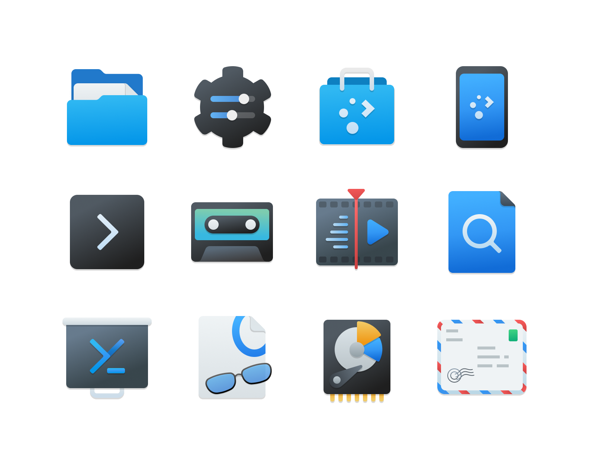
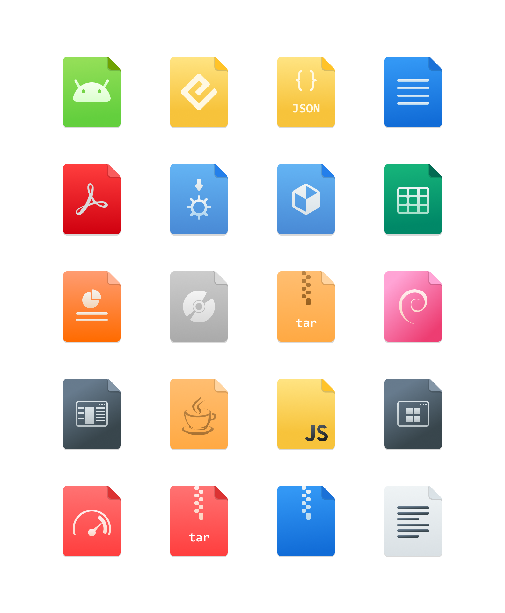
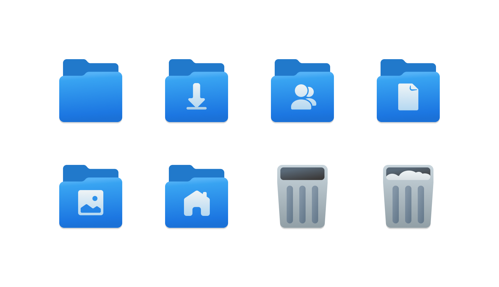
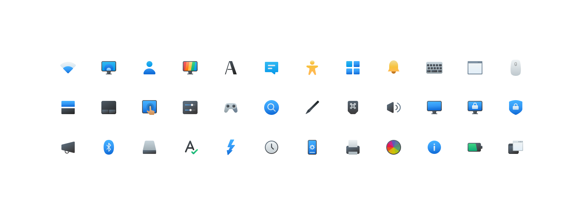
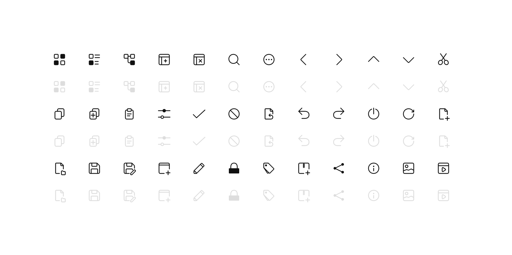

## Project Kaze

The Breeze icons, as the default theme icons for KDE 5 and 6, are classic. But they have gradually fallen behind popular aesthetics. The unofficial project Kaze is a refresh of the Breeze theme icons. It won't be very fancy or attractive, but it aims to achieve the classical and universal appeal of the Breeze icons.

Therefore, Kaze will not adopt highly saturated colors or overwhelming visual effects that cause fatigue. Instead, you will have a sense of familiarity while using it, which is exactly what I am striving for.

Here are some of the previews.

Screenshot

Apps

MimeTypes

Places

Preferences

Actions

If you are interested in contributing to the design and development, feel free to check the Figma template link [here](https://www.figma.com/design/WlM3gZ8lQ5zjlbzAaAKAIK/Kaze-icons?node-id=0-1&t=N9k8vPa9Q6y2NoLT-1) or submit a Pull Request :)
